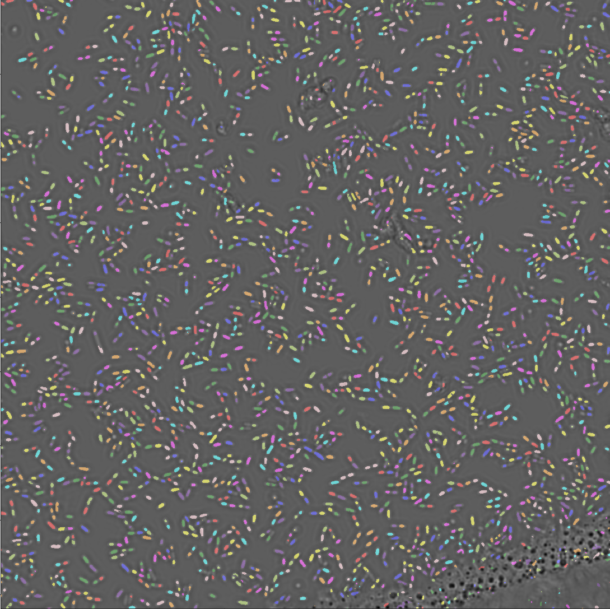

# DeepPlateSegmenter
DeepPlateSegmenter is a Python package designed to segment images acquired using Micro-Manager using convolutional neural networks.
Certain functions and the Jupyter notebooks are specifically designed to analyze data acquired using the plate acquisition
module of Micro-Manager, and to segment cells of phase correlation images. However the code can easily be recycled to accept other inputs.



## Installation
Download or clone this repository. To use it, add it to you python path or alternatively move to the folder DeepPlateSegmenter/deeplate and install using:  

pip3 install .

This installs several large packages as well as the Jupyter notebook environment. If you want to avoid polluting your environment with those installs, I recommend installing this package in a virtual environment.

Additionally you need to install tensorflow manually. It is not included in the installation to let the user choose whether to include the CPU version (pip3 install tensorflow) or the GPU one (pip3 install tensorflow-gpu).

## Specific instructions for installation in scicore cluster

To avoid any installation limitations, the whole software should run in a virtual environment. This is the recommended way of doing:

1. Download or clone this repository (I assume you leave it in your home directory).
2. Move to /DeepPlateSegmenter/deeplate and create two virtual environments, one for CPU, one for GPU:  

	```bash  
	ml purge  
	ml Python/3.5.2-goolf-1.7.20  
	virtualenv ~/DeepPlateSegmenter/venv-deeplate 
	source ~/DeepPlateSegmenter/venv-deeplate-gpu/bin/activate 
	pip3 install .  
	pip3 install tensorflow
	deactivate
	```  
	
	```bash
	ml purge  
	ml Python/3.5.2-goolf-1.7.20  
	virtualenv ~/DeepPlateSegmenter/venv-deeplate-gpu  
	source ~/DeepPlateSegmenter/venv-deeplate-gpu/bin/activate  
	pip3 install .  
	pip3 install tensorflow-gpu==1.4.0
	deactivate
	```  

3.	Every time you want to manually run software from this package activate one of the virtual environments (usually CPU) using:

	```bash
	ml purge  
	ml Python/3.5.2-goolf-1.7.20  
	source ~/DeepPlateSegmenter/venv-deeplate-gpu/bin/activate
	```  

4. Then you can run things from the command line, as usual, e.g. by running:  
	```bash
	python myprogram.py
	```  
	or you can run a Jupyter notebook by starting the environment using:  
	```bash
	ml Firefox
	jupyter notebook
	```
	Firefox is needed to open the Jupyter notebook.
5. To analyze a dataset, use the Jupyter notebook in the cluster folder. It automatically splits the analysis
of multiple positions in groups that are then sent for GPU calculation via slurm.
	

## Usage
The training set is created using ***generate\_plate\_training\_set.ipynb***. Segmentation is done on fluorescence and the used on the phase correlation images to create the trainin set. A weight-map is also created, allowing to enhance the importance of cell borders.  

The u-net convnet is trained in ***train\_plate.ipynb*** (should be run on a GPU e.g. on AWS).  

The weights learned in the training can then be used to segment any image as shown in ***deep\_plate\_analysis.ipynb***  

***MMData.py*** is a class creating a "Micro-Manager object". Metadata of the dataset can be accessed easily through the object.  

***platesegementer.py*** contains all functions related to segmentation.

## Required packages
skimage  
scipy  
numpy 
pandas  
PIL  
matplotlib  
Keras  
Tensorflow
